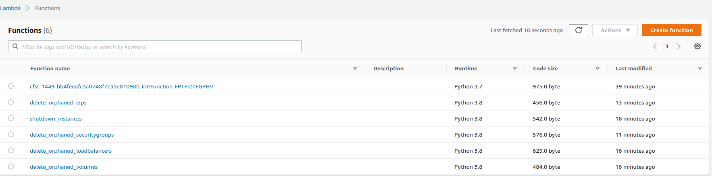
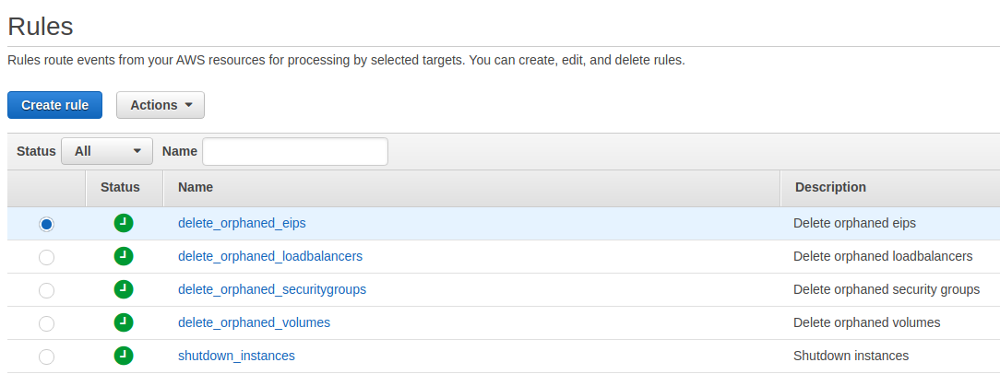

# aws-cost-management
 
### shutdown instances
Scheduled CloudWatch rule which triggers a Lambda to power off instances where tags match critera

### delete orphaned volumes
Scheduled CloudWatch rule which triggers a Lambda to delete orphaned volumes

### delete orphaned loadbalancers
Scheduled CloudWatch rule which triggers a Lambda to delete orphaned loadbalancers

### delete orphaned security groups
Scheduled CloudWatch rule which triggers a Lambda to delete orphaned security groups

### delete orphaned eips
Scheduled CloudWatch rule which triggers a Lambda to delete orphaned EIPs

### TODO
* Restrict IAM polices further
* Create TF for snapshot lambda.